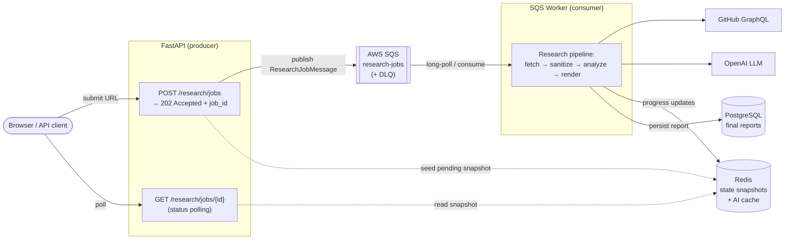

# GitHub Repository Research Tool

An **event-driven** service that turns a public GitHub repository URL into a structured, AI-assisted research report. The API never blocks on the heavy work: it acknowledges instantly, hands the job off to a durable message queue, and a decoupled worker drives the analysis pipeline to completion while the client polls for progress.

---

## ⚡ Event-Driven Architecture (the core idea)

The whole system is built around **asynchronous message passing** instead of synchronous request/response. The web tier and the processing tier share nothing but a queue — they can scale, fail, and restart independently.

### Why event-driven here

| Property | How it shows up in this project |
| --- | --- |
| **Non-blocking acknowledgment** | `POST /api/v1/research/jobs` returns `202 Accepted` with a `job_id` immediately after publishing a `ResearchJobMessage` — no waiting on GitHub or the LLM. |
| **Producer/consumer decoupling** | The FastAPI app only *publishes*. A separate `sqs_worker` process *consumes* and runs the pipeline. Each scales on its own. |
| **Durable delivery** | Jobs live in **SQS** (queue + dead-letter queue). A crashed worker doesn't lose work — the message becomes visible again. |
| **At-least-once + retries** | Visibility timeout, `ApproximateReceiveCount`, and a **redrive policy** route poison messages to a **DLQ** after `RESEARCH_MAX_QUEUE_ATTEMPTS`. |
| **Idempotency** | An AI cache key (`owner/repo@commit_sha`) lets duplicate jobs reuse a completed analysis instead of re-running the LLM. |
| **Eventual consistency, surfaced** | The worker streams progress into **Redis snapshots** (`pending → processing → completed/failed`); the browser polls them to render live status. |
| **Graceful degradation** | If the LLM is unavailable or hits a content policy, the pipeline falls back to a deterministic-only report instead of failing the job. |

### Event flow, step by step

1. **Submit** — API parses the URL, fetches instant metadata via GitHub GraphQL, writes a `pending` record + Redis snapshot, then **publishes** a job message to SQS and returns `job_id`.
2. **Consume** — the worker **long-polls** SQS, picks up the message, and runs `execute_research_pipeline`.
3. **Process** — fetch full repo context → sanitize into a token-budgeted prompt → run LLM analysis (with deterministic fallback) → render a Markdown report.
4. **Persist & notify** — the final report lands in PostgreSQL; the Redis snapshot flips to `completed`.
5. **Poll** — the client reads `GET /api/v1/research/jobs/{job_id}` against the Redis snapshot until the report is ready.
6. **Recover** — on failure the message retries; after max attempts it goes to the **DLQ** and the job is marked `failed`.

---

## 🧩 Design: Hexagonal (Ports & Adapters)

Every external dependency sits behind a typed **port** (an abstract interface), with a swappable **adapter** implementation. The pipeline and orchestration logic depend only on the ports, so infrastructure can be replaced or mocked without touching business logic.

| Port (interface) | Adapter (implementation) | Responsibility |
| --- | --- | --- |
| `IMessageQueue` | `SQSMessageQueueAdapter` | Publish/consume job messages, manage DLQ + visibility |
| `IStateCache` | `RedisStateCacheAdapter` | Pollable job snapshots + cached AI results |
| `IGitHubClient` | `GitHubGraphQLAdapter` | Deterministic repository ingestion via GraphQL |
| `ILLMClient` | `LLMAdapter` | Structured AI insights, typed provider errors |

This is what makes the queue itself swappable: `IMessageQueue` is the seam, and SQS (real AWS or local ElasticMQ) is just one adapter behind it.

---

## 🛠️ Tech Stack

**Core**
- **Python 3.12** with full `async/await` end to end
- **FastAPI** — async web framework, `202 Accepted` async API + auto OpenAPI docs
- **Pydantic v2** / **pydantic-settings** — typed message contracts, schemas, and config

**Event-driven & data**
- **AWS SQS** (via `aiobotocore` / `boto3`) — message queue with **dead-letter queue** and redrive policy
- **ElasticMQ** — drop-in local SQS for development
- **Redis** — transient job state snapshots and AI result caching
- **PostgreSQL** — durable report persistence
- **SQLAlchemy 2.0** (async, `asyncpg`) + **Alembic** migrations

**AI & ingestion**
- **OpenAI** — LLM analysis with deterministic fallback
- **GitHub GraphQL** — repository metadata and context fetching

**Presentation & ops**
- **Jinja2** — server-rendered research dashboard
- **msgspec** — fast JSON responses
- **loguru** — structured logging with `request_id` / `job_id` correlation across the async boundary
- **Docker Compose** — orchestrates API, worker, ElasticMQ, PostgreSQL, and Redis
- **uv** — dependency management and lockfile
- **Quality gates** — `ruff`, `isort`, `mypy`, `pyink`, `pre-commit`, `pytest` (async)

---

## 📦 Services

| Service | Role |
| --- | --- |
| `app` | FastAPI server — the event **producer** + status polling endpoints |
| `research-worker` | SQS **consumer** running the analysis pipeline |
| `elasticmq` | Local message broker (SQS-compatible) |
| `postgres` | Final report storage |
| `redis` | Job state snapshots + AI cache |
